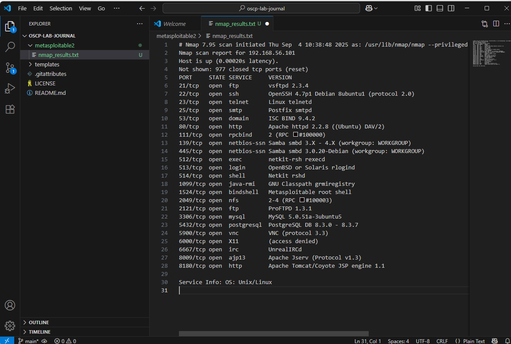
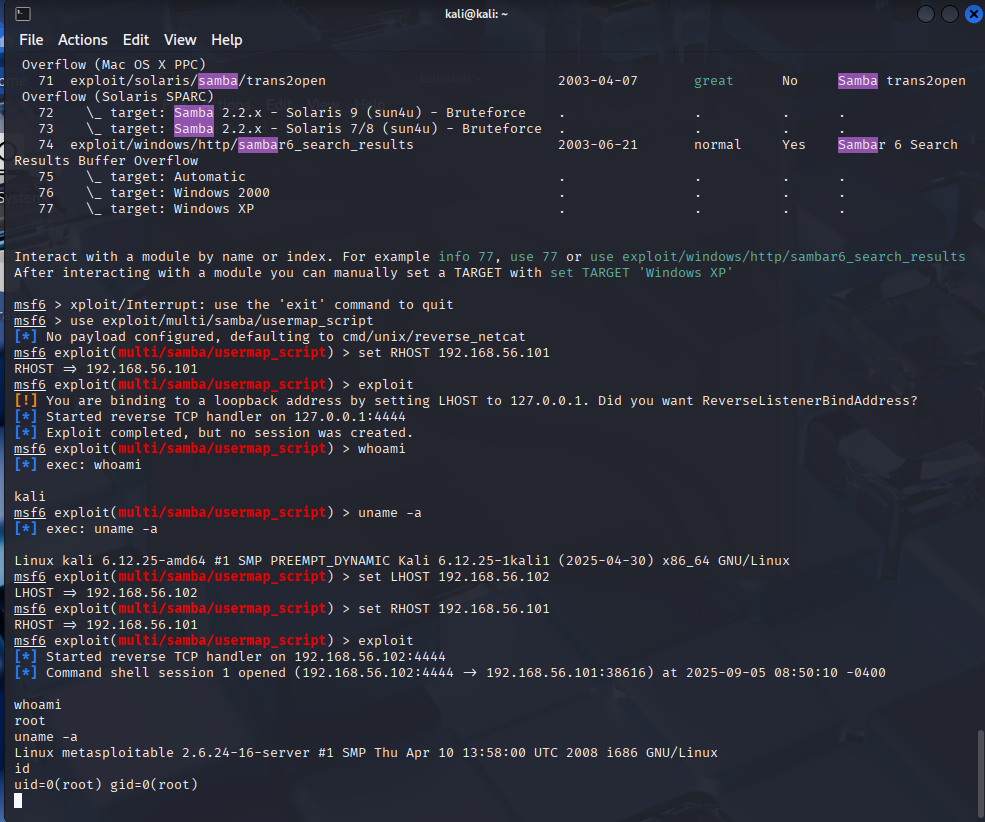

# OSCP Lab Journal

Hands-on pentesting practice in a safe VirtualBox lab (Host-Only networking).
Each entry follows a consistent workflow: **Recon → Vulnerability → Exploitation → Proof → Remediation**.

> Featured proof:  
> 

## 🔎 Live Index

### Metasploitable2
- **vsftpd 2.3.4 backdoor (ftp/21)** – [Write-up](./metasploitable2/exploit_vsftpd.md)  
  - [Nmap results](./metasploitable2/nmap_results.txt)  
  - [PDF report](./metasploitable2/reports/OSCP_Report_vsftpd.pdf)  
  - [Network setup screenshot](./metasploitable2/images/network-setup.png)  
  - [Root shell screenshot](./metasploitable2/images/root-shell.png)  

- **Samba 3.0.20 (port 445)** → [Write-up](./metasploitable2/exploit_samba.md)
  - [Nmap results](./metasploitable2/nmap_samba_results.txt)
  - [SMB enumeration](./metasploitable2/smb_enum_results.txt)
  - Screenshot: 

## 📁 Repo Structure

oscp-lab-journal/
├─ metasploitable2/
│ ├─ nmap_results.txt
│ ├─ exploit_vsftpd.md
│ ├─ reports/
│ │ └─ OSCP_Report_vsftpd.pdf
│ └─ images/
│ ├─ network-setup.png
│ └─ root-shell.png
└─ templates/
└─ report_entry_template.md

## 🧪 How I Work
- Enumerate with `nmap -sC -sV`, research versions/CVEs, exploit (Metasploit/manual),
  verify (`whoami`, `uname -a`), document impact, and propose remediation.
- All testing is done against intentionally vulnerable machines in an isolated lab.
